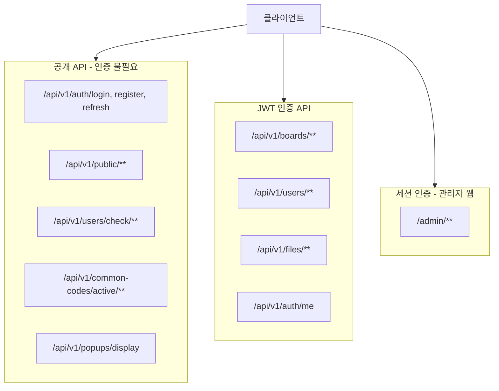
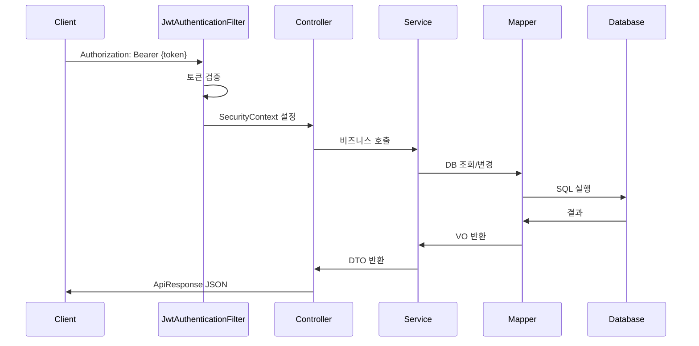
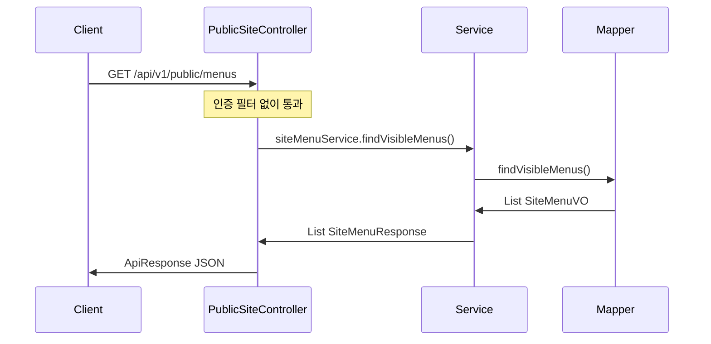
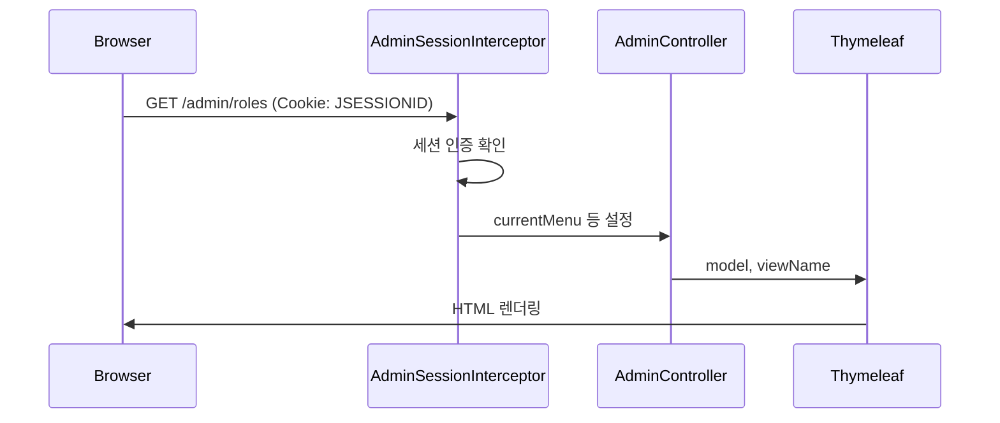
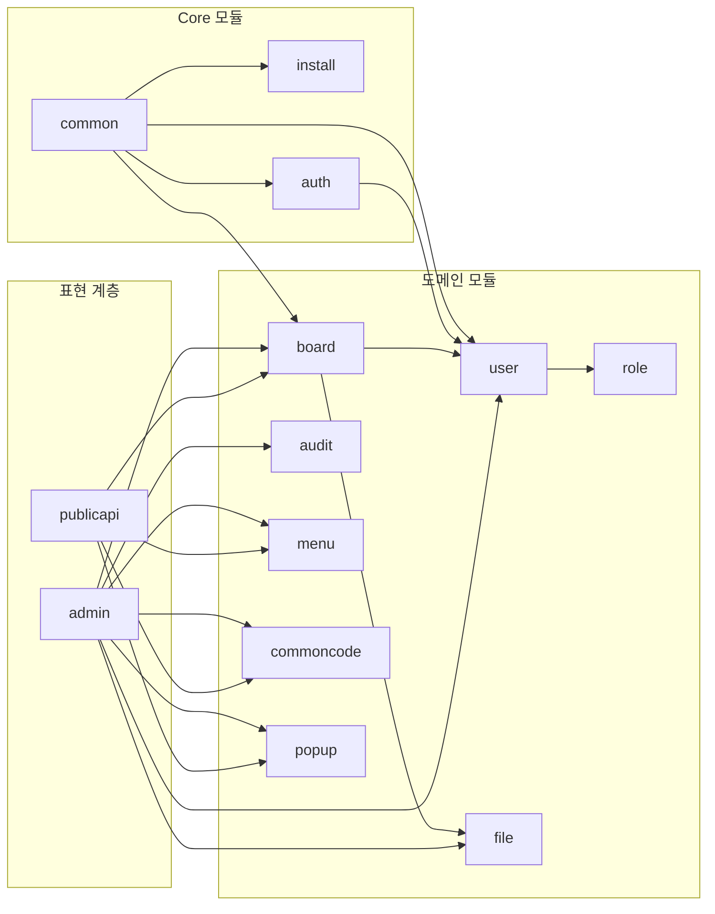

# CMS Core 아키텍처

> 프로젝트 아키텍처 정책은 [PROJECT_CONTEXT.md](../PROJECT_CONTEXT.md)를 참조합니다.

---

## 1. 계층 구조

```
┌─────────────────────────────────────────────────────────────┐
│  Controller (REST API / Thymeleaf View)                      │
│  - 요청 검증, 응답 포맷                                       │
│  - @Transactional 미사용                                     │
└──────────────────────────┬──────────────────────────────────┘
                           │
┌──────────────────────────▼──────────────────────────────────┐
│  Service (인터페이스 + Default 구현체)                        │
│  - 비즈니스 로직 전담                                         │
│  - @Transactional Service 계층에만 적용                       │
└──────────────────────────┬──────────────────────────────────┘
                           │
┌──────────────────────────▼──────────────────────────────────┐
│  Mapper (MyBatis XML)                                        │
│  - DB 접근, SQL 실행                                         │
│  - SELECT * 금지, 컬럼 명시                                   │
└─────────────────────────────────────────────────────────────┘
```

---

## 2. 패키지 구조

```
com.nt.cms
├── CmsApplication.java
├── common/                    # 공통 모듈
│   ├── config/                # SecurityConfig, CmsProperties, MybatisConfig 등
│   ├── exception/             # ErrorCode, BusinessException, GlobalExceptionHandler
│   ├── response/              # ApiResponse, PageResponse
│   ├── constant/              # Permission, SessionConstants
│   └── vo/                    # BaseVO
├── install/                   # 설치 마법사
├── auth/                      # 인증/인가 (JWT, Spring Security)
├── user/                      # 사용자 관리
├── role/                      # 역할 관리
├── permission/                # 권한 관리 (실제는 role 패키지와 연계)
├── board/                     # 게시판 (BoardGroup, Board, Post, Comment)
├── file/                      # 파일 관리
├── audit/                     # 감사 로그
├── menu/                      # 사이트 메뉴, 정적 페이지
├── commoncode/                # 공통 코드
├── popup/                     # 팝업 관리
├── admin/                     # 관리자 화면 (Thymeleaf, 세션 인증)
│   └── controller/            # AdminPostController, AdminFileController 등
└── publicapi/                 # 사용자단 공개 API (인증 불필요)
    └── controller/            # PublicSiteController, PublicBoardController
```

---

## 3. API 영역 구분



| 영역 | 경로 | 인증 | 용도 |
|------|------|------|------|
| 공개 API | `/api/v1/public/**`, `/api/v1/auth/login` 등 | 불필요 | 사용자 사이트(메뉴, 페이지, 게시판 조회) |
| JWT API | `/api/v1/boards/**`, `/api/v1/users/**` 등 | JWT Bearer | REST API (프론트엔드, 앱) |
| 관리자 웹 | `/admin/**` | 세션 | Thymeleaf 관리자 화면 |

---

## 4. 요청 흐름

### 4.1 API 요청 (JWT)



### 4.2 공개 API 요청



### 4.3 관리자 웹 요청



---

## 5. 모듈 의존 관계



**원칙**: Core 모듈은 Project 모듈에 의존하지 않음. `publicapi`는 기존 도메인 Service를 재사용.

---

## 6. 네이밍 컨벤션

| 구분 | 규칙 | 예시 |
|------|------|------|
| VO | 엔티티 데이터 | UserVO, BoardVO, PostVO |
| DTO | Request/Response | UserCreateRequest, UserResponse |
| Service | 인터페이스 | UserService |
| Service 구현체 | Default 접두어 | DefaultUserService |
| Mapper | DB 접근 | UserMapper, BoardMapper |
| 패키지 | 소문자, 단수형 | user, board, menu |
