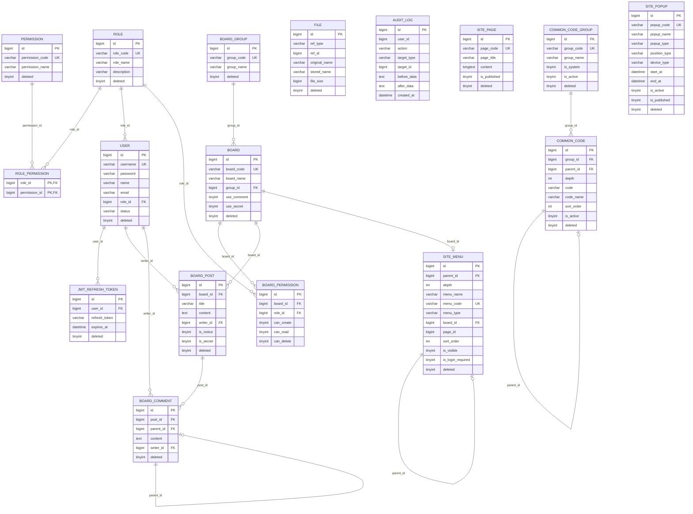

# CMS Core DB 구조 (ERD)

> Mermaid ER 다이어그램. GitHub, VS Code, Cursor에서 렌더링됩니다.
> 스키마 원본: [cms_schema](../cms_schema)

---

## ER 다이어그램

---

## 테이블 목록 (16개)

| 구분 | 테이블 | 설명 |
|------|--------|------|
| 권한 | role | 역할 마스터 (ADMIN, MANAGER, USER) |
| 권한 | permission | 권한 마스터 (USER_CREATE, USER_READ 등) |
| 권한 | role_permission | 역할-권한 N:M 매핑 |
| 사용자 | user | 사용자 정보 |
| 인증 | jwt_refresh_token | JWT 리프레시 토큰 |
| 게시판 | board_group | 게시판 그룹 |
| 게시판 | board | 게시판 설정 |
| 게시판 | board_permission | 게시판별 역할별 CRUD 권한 |
| 게시판 | board_post | 게시글 |
| 게시판 | board_comment | 댓글 (대댓글 1단계) |
| 파일 | file | ref_type, ref_id 다형적 연결 |
| 감사 | audit_log | 변경 이력 로그 |
| 사이트 | site_menu | 계층형 메뉴 |
| 사이트 | site_page | 정적 페이지 |
| 코드 | common_code_group | 공통코드 그룹 |
| 코드 | common_code | 공통코드 상세 (계층) |
| 팝업 | site_popup | 사용자 사이트 팝업 |

---

## 공통 컬럼 (BaseVO)

대부분의 테이블은 다음 공통 컬럼을 포함합니다.

| 컬럼 | 타입 | 설명 |
|------|------|------|
| id | BIGINT | Primary Key |
| created_at | DATETIME | 생성 일시 |
| created_by | BIGINT | 생성자 ID |
| updated_at | DATETIME | 수정 일시 |
| updated_by | BIGINT | 수정자 ID |
| deleted | TINYINT(1) | Soft Delete 플래그 (0:활성, 1:삭제) |

---

## Soft Delete 규칙

- 모든 테이블은 **Soft Delete** 사용 (하드 Delete 금지)
- `deleted = 0`: 활성 데이터
- `deleted = 1`: 삭제된 데이터
- 모든 조회 쿼리에 `WHERE deleted = false` (또는 `deleted = 0`) 조건 포함
