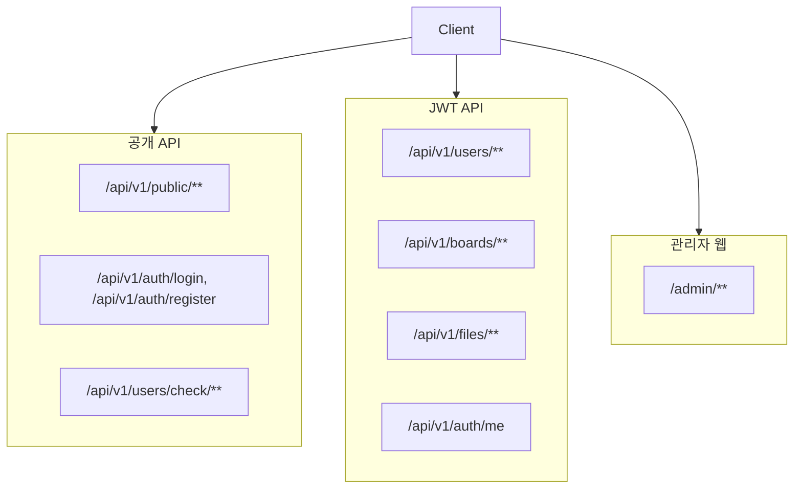
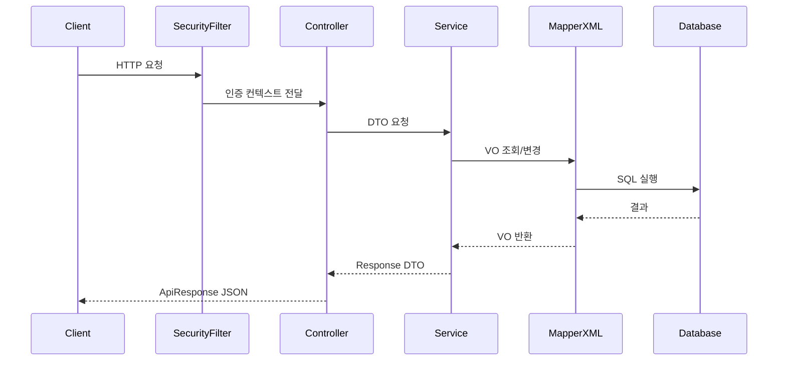

# CMS Core 아키텍처

> 프로젝트 아키텍처의 단일 기준 문서입니다.  
> 상세 개발 우선순위와 운영 컨텍스트는 `docs/CONTEXT.md`를 참조합니다.

---

## 1. 계층 구조 원칙

```text
Controller -> Service(Interface + Default Impl) -> Mapper(MyBatis XML) -> DB
```

- Controller: 요청 검증, 응답 포맷 처리, 비즈니스 로직 금지
- Service: 비즈니스 로직 전담, `@Transactional` 사용 가능 계층
- Mapper: DB 접근 전담, SQL은 XML에만 작성
- DB: MariaDB(주), PostgreSQL(추후)

---

## 2. 패키지 구조

```text
com.nt.cms
├── common        # config/exception/response/constant/vo
├── install       # 설치 마법사
├── auth          # 인증/인가(JWT, 세션)
├── user          # 사용자
├── role          # 역할/권한 매핑
├── board         # 게시판/게시글/댓글
├── file          # 파일 업로드/다운로드
├── audit         # 감사 로그
├── menu          # 사이트 메뉴/정적 페이지
├── commoncode    # 공통코드
├── popup         # 팝업
├── rental        # 대관(장소/룸/요금/달력/예약)
├── admin         # 관리자(Thymeleaf)
└── publicapi     # 사용자 공개 API
```

---

## 3. 요청 영역 분리



---

## 4. 인증/세션 모델

- 관리자 웹: 세션 기반(`/admin/**`)
- API: JWT Bearer 기반
- 사용자 사이트(`/site/**`): Site 세션 분리 운영
- 공개 API(`/api/v1/public/**`): 인증 없이 조회, 일부 엔드포인트는 정책상 로그인 필요 가능

---

## 5. 핵심 모듈 흐름



---

## 6. 데이터/트랜잭션 규칙

- 모든 핵심 테이블 Soft Delete 사용(`deleted` 기준)
- `SELECT *` 금지, 컬럼 명시
- 동적 검색은 `<where> + <if>` 기준
- 페이징은 `limit/offset` 기준
- 트랜잭션 경계는 Service 계층에서만 관리

---

## 7. 사용자 사이트/React 동기화 원칙

- CMS 템플릿(`/site/**`)과 `cms_user_react`는 동일 API를 기준으로 동작
- XSS 허용 태그는 React `sanitizer.ts` 기준으로 동기화
- 라우팅/핵심 UX 변경 시 양쪽 문서와 구현을 동시에 업데이트

---

## 8. 관련 문서

- API: `docs/API.md`
- DB ERD: `docs/EDR.md`
- 설치/설정: `docs/SETTING.md`
- 운영 매뉴얼: `docs/MANUAL.md`
- 프로젝트 컨텍스트: `docs/CONTEXT.md`
