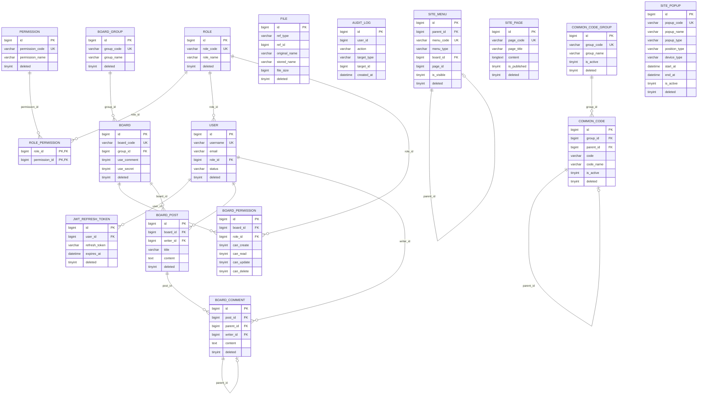

# CMS Core DB 구조 (EDR)

> 기존 ERD 문서를 `docs` 체계로 이관한 기준 문서입니다.  
> 스키마 원본은 루트 `cms_schema` 및 `src/main/resources/schema/*.sql`을 참조합니다.

---

## 1. ER 다이어그램

---

## 2. 공통 데이터 규칙

- 모든 핵심 테이블은 Soft Delete(`deleted`) 사용
- 공통 필드는 `BaseVO` 기준으로 관리
  - `id`, `createdAt`, `createdBy`, `updatedAt`, `updatedBy`, `deleted`
- 하드 삭제 금지

---

## 3. 테이블 분류

- 인증/권한: `role`, `permission`, `role_permission`, `user`, `jwt_refresh_token`
- 콘텐츠: `board_group`, `board`, `board_permission`, `board_post`, `board_comment`
- 사이트: `site_menu`, `site_page`, `site_popup`
- 공통/운영: `common_code_group`, `common_code`, `file`, `audit_log`
- 대관: `rental_place`, `rental_room`, `rental_reservation`, 요금/달력 관련 테이블

---

## 4. 대관 모듈 상세 참고

- 구조: `docs/RENTAL_MODULE_STRUCTURE.md`
- 요금: `docs/RENTAL_PRICING_LOGIC.md`
- 파일 참조: `docs/RENTAL_FILES_REFERENCE.md`
