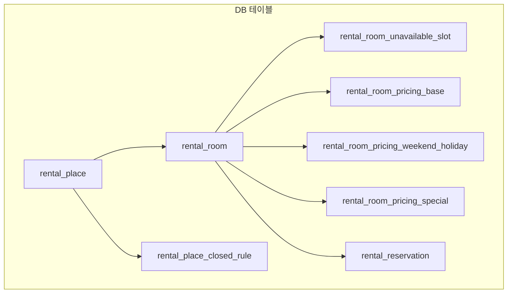

# 렌탈 모듈 구조 정리

렌탈 관련 코드베이스의 패키지 구조, DB 스키마, API/URL, 서비스·컨트롤러 역할, 데이터 흐름을 정리한 문서입니다.

---

## 1. 전체 아키텍처 개요

렌탈 모듈은 **장소(Place) → 룸(Room)** 계층 위에 **휴관/공휴일 규칙**, **대여불가 구간**, **요금(기본/주말·공휴/특수)**, **예약**이 붙는 구조입니다. 달력(Calendar) 서비스가 이 데이터를 모아 일별·슬롯별 가용 여부와 요금을 계산합니다.

---

## 2. 패키지 구조 (Java)

경로: `src/main/java/com/nt/cms/rental/`

| 도메인 | 역할 | 주요 클래스 |
|--------|------|-------------|
| **place** | 장소 CRUD | `AdminRentalPlaceController`, `RentalPlaceService`, `RentalPlaceMapper`, VO/DTO |
| **room** | 룸 CRUD, 대여불가 구간 | `AdminRentalRoomController`, `AdminRentalUnavailableSlotController`, `RentalRoomService`, `RentalUnavailableSlotService`, Mapper/VO/DTO |
| **calendar** | 휴관 규칙 + 달력 집계 | `AdminRentalClosedRuleController`, `RentalCalendarAdminController`, `RentalCalendarPublicController`, `RentalCalendarService`, `RentalClosedRuleService`, `RentalCalendarMapper`, `RentalClosedRuleMapper` |
| **pricing** | 기본/주말·공휴/특수 요금 | `AdminRentalPricingController`, `RentalPricingService`, `RentalPricingMapper`, DTO |
| **reservation** | 예약 생성·조회·승인·취소 | `RentalReservationAdminController`, `RentalReservationPublicController`, `PublicRentalReservationController`, `RentalReservationService`, Mapper/VO/DTO |
| **publicapi** | 공개 API (장소/룸/달력) | `PublicRentalController`, `PublicRentalReservationController` |

- **진입점(뷰)**: `AdminRentalController` — `/admin/rental/*/view` → Thymeleaf 템플릿만 반환.
- **실제 CRUD/비즈니스**: 각 도메인별 `Admin*Controller`(REST) + Service + Mapper.

---

## 3. DB 스키마 (요약)

- **rental_place**: 장소명, 주소, 설명, 타임존, opening_time/closing_time, 감사필드, deleted.
- **rental_room**: place_id(FK), 이름, 설명, capacity, default_duration_minutes, 감사필드, deleted.
- **rental_place_closed_rule**: place_id(FK), rule_type, start_date/end_date, week_day, holiday_name — 휴관/공휴일 규칙.
- **rental_room_unavailable_slot**: room_id(FK), scope_type(DATE_RANGE / ONE_TIME / WEEKLY_TIME), start_datetime/end_datetime, week_day, start_time/end_time, reason — 룸별 대여불가 구간.
- **rental_room_pricing_base**: room_id(FK), unit_minutes(60 고정), price — 룸당 1건. **룸 설정**에서 관리.
- **rental_room_pricing_weekend_holiday**: room_id(FK), apply_to(WEEKEND/HOLIDAY/BOTH), unit_minutes(60), price — 주말·공휴일 요금. **룸 설정**에서 관리.
- **rental_room_pricing_special**: room_id(FK), date, start_time, end_time, unit_minutes(60), price — 특정 일·시간대 특수 요금. **요금 달력**에서 관리.
- **rental_reservation**: room_id(FK), user_id(FK), start_datetime, end_datetime, status, total_price, memo, payment_status, payment_id, 감사필드, deleted.

스키마 파일: `src/main/resources/schema/schema-h2.sql`, `src/main/resources/schema/schema-mariadb.sql` (렌탈 구간 동일 구조).

---

## 4. URL / API 정리

### 관리자 (Admin)

- **뷰 (HTML)**
  - `AdminRentalController`: `/admin/rental/places/view`, `/rooms/view`, `/pricing/view`, `/unavailable-slots/view`, `/calendar/view`
  - 휴관·공휴일 규칙은 **요금 달력**(`/pricing/view`)에서 관리 (별도 메뉴 제거)
- **REST API (데이터)**
  - 장소: `GET/POST /admin/rental/places`, `GET/PUT /admin/rental/places/{id}`
  - 룸: `GET/POST /admin/rental/rooms`, `GET/PUT /admin/rental/rooms/{id}`
  - 대여불가: `GET/POST /admin/rental/rooms/{roomId}/unavailable-slots`, `PUT/DELETE .../unavailable-slots/{id}`
  - 요금: `GET/PUT /admin/rental/rooms/{roomId}/pricing/base`, `.../pricing/weekend-holiday`, `.../pricing/special`
  - 휴관 규칙: `GET/POST /admin/rental/places/{placeId}/closed-rules`, `PUT/DELETE .../closed-rules/{id}` (place 기준)
  - 달력: `GET /admin/rental/calendar?placeId=&roomId=&fromDate=&toDate=&slotMinutes=` (관리자용 달력 데이터)
  - 예약: `GET /admin/rental/reservations` (검색), `POST .../reservations/{id}/confirm`, `.../reject`, `.../cancel`

### 공개 API (사이트/프론트)

- **v1/public/rentals** (`PublicRentalController`)
  - `GET /api/v1/public/rentals/places`
  - `GET /api/v1/public/rentals/places/{placeId}/rooms`
  - `GET /api/v1/public/rentals/rooms/{roomId}/calendar?placeId=&fromDate=&toDate=&slotMinutes=`
- **v1/public/rentals 예약** (`PublicRentalReservationController`)
  - `POST /api/v1/public/rentals/rooms/{roomId}/reservations`
  - `GET /api/v1/public/rentals/reservations/my`, `GET .../reservations/{id}`
  - `DELETE .../reservations/{id}` (사용자 취소)
- **v1/rental (인증 기반)**
  - `RentalCalendarPublicController`: `GET /api/v1/rental/search` — 달력 검색.
  - `RentalReservationPublicController`: `POST /api/v1/rental/reservations`, `GET .../reservations/my`, `GET .../reservations/{id}`, `POST .../reservations/{id}/cancel`.

즉, 공개용은 **v1/public/rentals** 와 **v1/rental** 두 축이 있음.

---

## 5. 달력(Calendar) 데이터 흐름

`RentalCalendarService` / `DefaultRentalCalendarService` 가 다음을 수행합니다.

1. **입력 검증** (`validateRequest`): `roomId`, `yearMonth` 필수 검사.
2. **데이터 로딩** (`loadCalendarData`): **RentalCalendarMapper**로 기간 내 데이터 조회
   - 휴관 규칙(`findPlaceClosedRules`), 룸 대여불가(`findRoomUnavailableSlots`), 기본 요금(`findBasePricing`), 주말·공휴 요금(`findWeekendHolidayPricing`), 특수 요금(`findSpecialPricing`), 예약(`findReservations`).
   - 결과를 `CalendarData` 레코드로 묶어 전달.
3. **일별 구성** (`buildDay`): 일별로 휴관 여부 판단 후, 해당 일이 열린 날에만 **슬롯 생성** (`buildSlots`).
4. **슬롯별 구성** (`buildSlot`): 대여불가 구간·기존 예약과 겹치면 비가능, 아니면 가능 + 적용 요금(특수 > 주말/공휴 > 기본) 계산.
5. 결과를 `List<RentalCalendarDayResponse>` (일별 + 슬롯 리스트)로 반환.

매퍼 정의: `src/main/resources/mapper/rental/RentalCalendarMapper.xml`.

---

## 6. 관리자 UI (템플릿)

| 템플릿 | 역할 |
|--------|------|
| `places.html` | 장소 CRUD |
| `rooms.html` | 룸 CRUD (기본/주말 요금 포함), 기본 예약 단위 1시간 고정 |
| `pricing.html` | FullCalendar 기반 요금 달력, 특수 요금·공휴일·휴관일 설정 |
| `unavailable-slots.html` | 룸별 대여불가 구간 |
| `calendar.html` | 일별 슬롯 가용여부·요금 조회 |

- **메뉴** (`layout.html`): 예약 장소, 예약 공간, 예약 요금, 예약 관리 - 달력, 예약 관리 - 목록 (UI 문구는 "예약"으로 통일)
- **휴관·공휴일**: 요금 달력에서 날짜 클릭으로 지정. 별도 `closed-rules.html`에서 장소별 휴관 규칙 관리 가능.

---

## 7. 수정 시 참고 포인트

- **도메인 추가/필드 변경**: 해당 도메인 패키지(place, room, calendar, pricing, reservation)의 VO·DTO·Mapper(XML)·Service·Controller 순으로 맞추면 됨.
- **스키마 변경**: `src/main/resources/schema/schema-h2.sql`, `src/main/resources/schema/schema-mariadb.sql` 둘 다 수정하고, 필요 시 Flyway 등 마이그레이션 추가.
- **달력 로직 변경**: `DefaultRentalCalendarService`와 `RentalCalendarMapper.xml`.
- **예약 규칙/상태**: `RentalReservationService` 및 `DefaultRentalReservationService`.

---

## 8. 요금 로직 상세

요금 계산, 적용 우선순위, API 사용법 등은 **`docs/RENTAL_PRICING_LOGIC.md`**를 참고하세요.  
사용자 예약·관리자 예약·정산 등에서 동일한 규칙을 사용할 수 있도록 정리되어 있습니다.

---

## 9. 예약 상태 플로우

| 상태 | 설명 |
|------|------|
| REQUESTED | 사용자 신청 직후 |
| CONFIRMED | 관리자 승인 |
| REJECTED_BY_ADMIN | 관리자 거절 |
| CANCELLED_BY_USER | 사용자 취소 |
| CANCELLED_BY_ADMIN | 관리자 취소 |

---

## 10. 테스트

- **단위 테스트**: `src/test/java/com/nt/cms/rental/`
  - `calendar/service/DefaultRentalCalendarServiceTest`: 입력 검증, 휴관 규칙 적용, 기본 캘린더 반환
  - `reservation/service/DefaultRentalReservationServiceTest`: 예약 생성(정상/시간 역전/중복), 검색 합계
  - `pricing/service/DefaultRentalPricingServiceTest`: 기본 요금 upsert, 주말·공휴일 요금 update/insert
- **컨트롤러 테스트**: `calendar/controller/RentalCalendarPublicControllerTest` — `GET /api/v1/rental/search` 200/400
